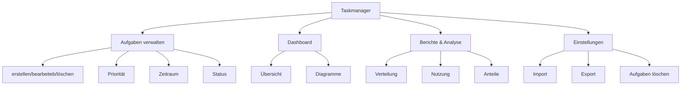

# PROJECT REPORT
---
# Project Review 01

## Wie hat uns SCRUM geholfen?
SCRUM hat uns in diesem Projekt kaum unterstützt. Die Methodik wirkte eher wie eine zusätzliche organisatorische Belastung. Der Nutzen blieb im Vergleich zum Aufwand gering.

## Wie hat uns SCRUM behindert?
Die Einteilung der Aufgaben nach SCRUM war mit zusätzlichem Zeitaufwand verbunden. Da mehrere Teammitglieder an eigenen Versionen gearbeitet haben, war das parallele Arbeiten an derselben Datei kaum möglich. Schlussendlich wurde im Vier-Augen-Prinzip gearbeitet, um das Beste mit dem möglichen Mitteln zu erreichen.

## Wo stehen wir gerade?
Wir haben eine voll funktionsfähige Taskmanager-Webapplikation entwickelt, die unsere ursprünglichen Anforderungen deutlich übertrifft. Neben den Basisfunktionen enthält sie ein Dashboard, eine Statistikansicht und speichert alle Daten in einer separaten ` .json-Datei`. Die Anwendung ist stabil und einsatzbereit.

## Was kommt als Nächstes?
Als Nächstes werden kleinere Optimierungen vorgenommen, z. B. zur Verbesserung der Performance und Nutzerfreundlichkeit. Im Team wird außerdem besprochen, welche Funktionen noch ergänzt oder überarbeitet werden können. Der Fokus liegt nun auf Feinschliff und Qualitätssicherung.

---

---

# Projekt Review 02

## Was ist in den vergangenen Sprints gut gelaufen?
Der Code hat inzwischen eine stabile und gut strukturierte Basis, was Erweiterungen erleichtert. Viele Funktionen des Taskmanagers sind bereits umgesetzt, wodurch nur noch wenige neue Anforderungen bestehen. Insgesamt verlief die Entwicklung bisher sehr erfolgreich und zielgerichtet.

## Wo stehen wir gerade & was kommt als Nächstes?
Wir verfügen über eine funktionsfähige Webapplikation mit einem umfangreichen Taskmanager. Der Fokus liegt nun auf der Umsetzung einer Synchronisationsfunktion, um Daten geräteübergreifend aktuell zu halten. Dazu werden in den nächsten Sprints verschiedene Methoden recherchiert.

## Wie hat sich die Komplexität in unserem Projekt entwickelt?
Durch die Einführung der Webapplikation ist die Komplexität gestiegen. Neue Abhängigkeiten, etwa in der `requirements.txt`, wurden eingebunden und die Systemarchitektur erweitert. Trotz dieser Herausforderungen konnten wir die Entwicklung gut kontrollieren.

## Wie gehen wir damit um?
Das Repository wächst zwar, bleibt aber durch klare Strukturierung und Dokumentation übersichtlich. Neue Funktionen werden systematisch integriert und regelmäßig überprüft. So stellen wir sicher, dass das Projekt auch bei wachsender Größe stabil und verständlich bleibt.

---
# Produkt Review

## Welche User-Stories haben wir erfolgreich umgesetzt?

- Beschreibungen zu Tasks hinzufügen
- Nach Prioritäten sortieren
- Fälligkeitsdatum hinzufügen
- Tasks bearbeiten
- Tasks löschen
- Tasks anlegen
- Tasks abschließen

## Welche User-Stories mussten wir zurückstellen, oder konnten wir nicht umsetzen?

- An Task erinnert werden
- Synchronisierung
- Listen erstellen **(stattdessen wurden Tags eingeführt)**

## Wie sieht unsere App am Ende der Projektlaufzeit aus?

Bei unserer App kann man nun zwischen verschiedenen Seiten wechseln - Dashboard, Aufgabenverwaltung, Bericht & Analyse und den Einstellungen.
- Im Dashboard hat man eine Übersicht über die Aufgaben inkl. Anzahl, Erledigt, Statistiken und Details der Aufgaben
- Bei der Aufgabenverwaltung kann man neue Aufgaben detailiert hinzufügen und filtern
- Bei Bericht & Analyse kann man eine Auswertung sehen
- Unter Einstellungen kann man alle Aufgaben löschen, die Aufgaben als '.json' exportieren oder eine andere importieren

## Wie gut passt unser Finales Produkt zu der eingangs formulierten Produkt Vision?

Die ursprüngliche Vision war sehr an den herkömmlichen Taskmanager gehalten, je weiter wir jedoch im Projekt kamen, umso mehr wurde die App angepasst und zunehmend verbessert. Es kamen neue Funktionen wie die verschiedensten Auswertungen und die Synchronisierung mittels einer '.json'-Datei dazu. Im Enddefekt kann unser Produkt um einiges mehr als die formulierte Produkt Vision.

---

# Die Web-Applikation

https://taskmanager-app.streamlit.app/

# Das Github Repository

https://github.com/MaxBracco/taskmanager-app
](https://github.com/MaxBracco/taskmanager-app)
