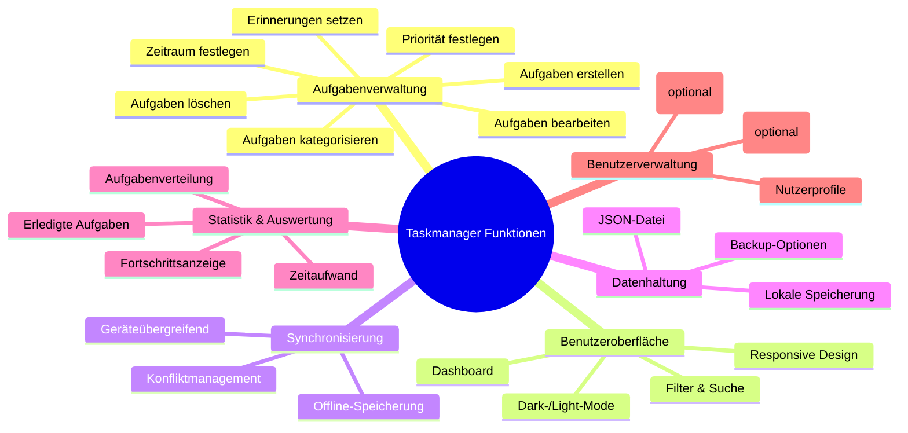

# PROJECT REPORT

## Wie hat uns SCRUM geholfen?
SCRUM hat uns in diesem Projekt kaum unterstützt. Die Methodik wirkte eher wie eine zusätzliche organisatorische Belastung. Der Nutzen blieb im Vergleich zum Aufwand gering.

## Wie hat uns SCRUM behindert?
Die Einteilung der Aufgaben nach SCRUM war mit zusätzlichem Zeitaufwand verbunden. Da mehrere Teammitglieder an eigenen Versionen gearbeitet haben, war das parallele Arbeiten an derselben Datei kaum möglich. Schlussendlich wurde im Vier-Augen-Prinzip gearbeitet, um das Beste mit dem möglichen Mitteln zu erreichen.

## Wo stehen wir gerade?
Wir haben eine voll funktionsfähige Taskmanager-Webapplikation entwickelt, die unsere ursprünglichen Anforderungen deutlich übertrifft. Neben den Basisfunktionen enthält sie ein Dashboard, eine Statistikansicht und speichert alle Daten in einer separaten ` .json-Datei`. Die Anwendung ist stabil und einsatzbereit.

## Was kommt als Nächstes?
Als Nächstes werden kleinere Optimierungen vorgenommen, z. B. zur Verbesserung der Performance und Nutzerfreundlichkeit. Im Team wird außerdem besprochen, welche Funktionen noch ergänzt oder überarbeitet werden können. Der Fokus liegt nun auf Feinschliff und Qualitätssicherung.

---

---

# Zwischenbilanz – Stand 10.06.2025

# Was ist in den vergangenen Sprints gut gelaufen?
Der Code hat inzwischen eine stabile und gut strukturierte Basis, was Erweiterungen erleichtert. Viele Funktionen des Taskmanagers sind bereits umgesetzt, wodurch nur noch wenige neue Anforderungen bestehen. Insgesamt verlief die Entwicklung bisher sehr erfolgreich und zielgerichtet.

# Wo stehen wir gerade & was kommt als Nächstes?
Wir verfügen über eine funktionsfähige Webapplikation mit einem umfangreichen Taskmanager. Der Fokus liegt nun auf der Umsetzung einer Synchronisationsfunktion, um Daten geräteübergreifend aktuell zu halten. Dazu werden in den nächsten Sprints verschiedene Methoden recherchiert.

# Wie hat sich die Komplexität in unserem Projekt entwickelt?
Durch die Einführung der Webapplikation ist die Komplexität gestiegen. Neue Abhängigkeiten, etwa in der `requirements.txt`, wurden eingebunden und die Systemarchitektur erweitert. Trotz dieser Herausforderungen konnten wir die Entwicklung gut kontrollieren.

# Wie gehen wir damit um?
Das Repository wächst zwar, bleibt aber durch klare Strukturierung und Dokumentation übersichtlich. Neue Funktionen werden systematisch integriert und regelmäßig überprüft. So stellen wir sicher, dass das Projekt auch bei wachsender Größe stabil und verständlich bleibt.
